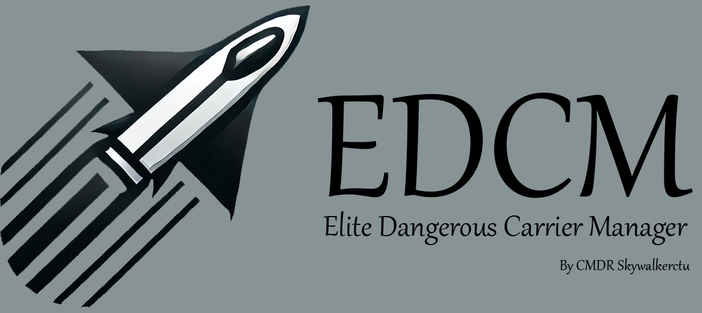
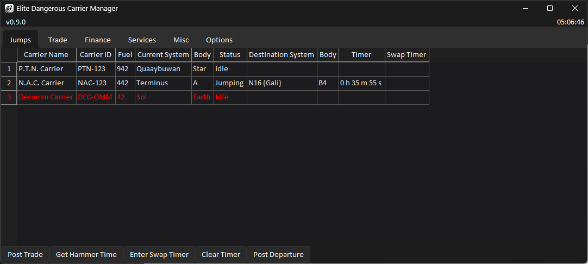
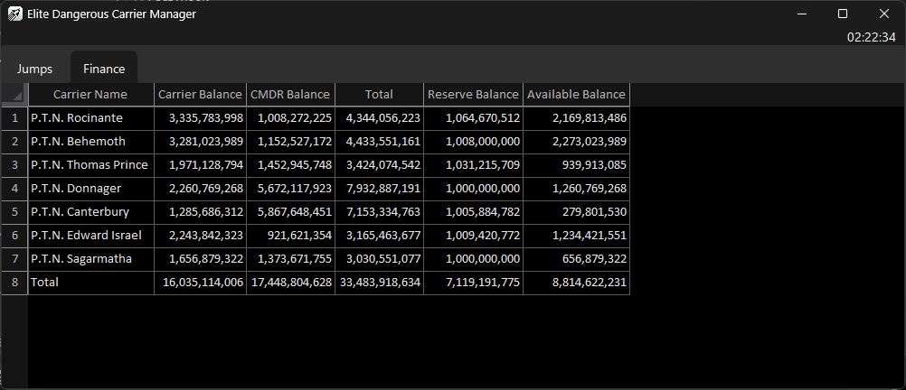
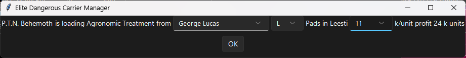

# Elite Dangerous Carrier Manager (EDCM)

EDCM is a third-party tool that helps you keep track of all your carriers in Elite Dangerous. The tool also provides some auxiliary functions to help with your daily trading and financial management.

Jumps and location

Credit balance at a glance

Easy trade posting
## Supported Game Versions
The tool is designed to work with the **Live** version of the game. 
## Supported Platforms
Currently only Windows 11 is supported. Windows 7/8/10 *should* work fine but has not been tested. 
## Features
### Main Features
- Real-time location of all your fleet carriers
- Real-time jump countdowns and jump status (i.e. jump locked, pad locked, cooldown)
- Credit balance overview of all carriers and their respective CMDRs
- Trade overview of all carriers
### Trading Assist
- Generate jump countdowns timers in hammertime format
- Generate trade post command/snippet
  - After a buy/sell order is set, you can click `Post Trade` to auto generate the command/snippet to post your trade
  - The tool will read the system, type of order, commodity, and number units, as well as retrieve the list of stations in the system
  - You only need to select which station you are trading with and put in the profit and click OK
  - The command will then be copied to your clipboard for you to post it
### Booze Cruise Assist
- Shows N# for systems on the ladder
  - For example, when your carrier is in the system `Gali`, it will be displayed as `N16 (Gali)`
- Post departure notice
  - After a jump is plotted to/from above N2, the wine carrier departure command can be generated and copied to your clipboard with click of a button
- Wine unload command
  - After wine sell order is set and the carrier is at the peak, a wine unload command will be generated and copied to your clipboard after clicking the `Post Trade` button
- Timer reminder
  - You can enter the swap timer provided to you and you will get a reminder to plot your jump 2 minutes prior and another at the exact time
  - Do Not rely on this feature to plot your jump! You are solely responsible to plot your jump on time, this is only a reminder in case you get distracted
## Installation
Simply download the EDCM.exe file from releases and launch it. 
## Limitations
Some limitations may be addressed in later updates thoon, maybe, eventually... don't count on it
- EDCM is currently English only
- This tool relys your local journal files
  - If you have moved, deleted or otherwise modified your journal files it may result in inaccurate information or unexpected bahavior
  - If you play on multiple machines, you will need to find a way to sync up your journal files
- Information updates every 30 seconds (countdowns and in-game clock updates at real-time)
- The post trade function
  - Currently only supports PTN CCO post format
  - It uses <a href=https://www.edsm.net>EDSM</a> to retrieve the list of stations in system. It may result in an error if it can't reach it
  - It only sees the last order set, so if you first set a buy order of 22k wine and then set a buy order of 2k trit, the tool will generate the buy order for 2k trit, not the 22k of wine
- Balance updates
  - Carrier balances are updated on log-in and everytime you open up your carrier management menu
  - CMDR balances only updates on log-in
## Known Issues
- Launching it takes a good while and may appear unresponsive or not show anything while it's loading, just give it some time, I promise it'll show up, *usually*. 
- Performance it **far** from optimized, it may consume a bit more CPU and ram than you expected but shouldn't be *too* bad
## Acknowledgements
Thank you <a href=https://github.com/aussig>aussig</a> for the <a href=https://github.com/aussig/BGS-Tally/tree/develop/data>lists of commodities</a>, related files are in the `3rdParty\aussig.BGS-Tally` folder with the corresponding license file. 
## Disclaimers
Although influenced a lot by the <a href=https://pilotstradenetwork.com>Pilots Trade Network (PTN)</a> in its design, EDCM is not endorsed by or affliated with the PTN and is not an offical tool of any player group. 