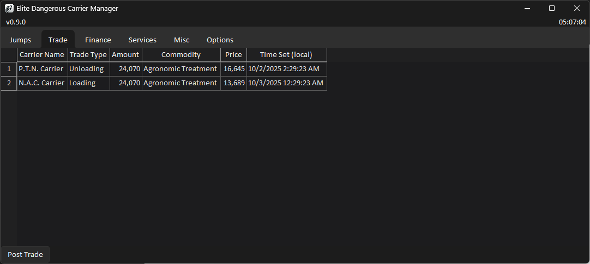
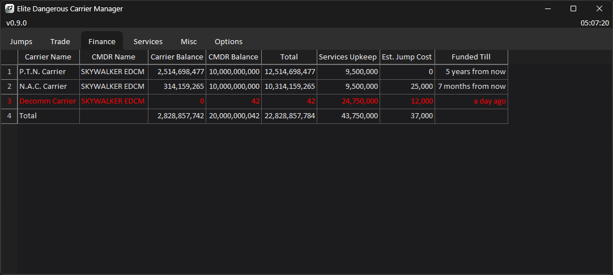
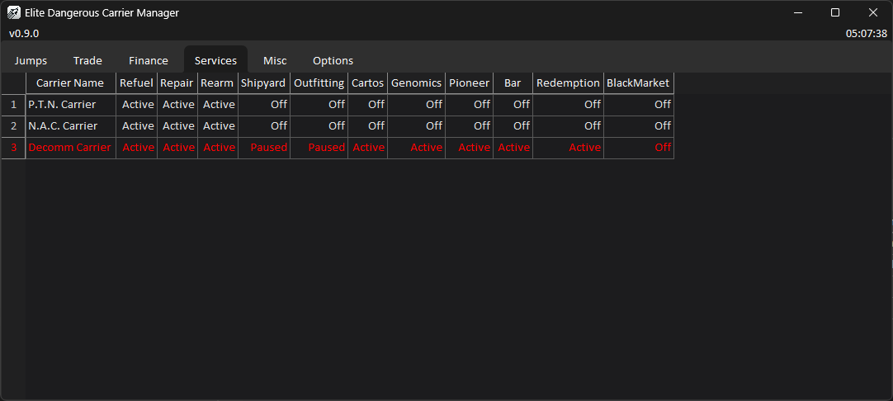
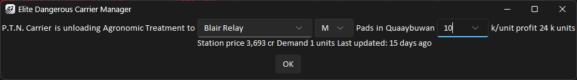

# Elite Dangerous Carrier Manager (EDCM)
    

EDCM is a third-party tool that helps you keep track of all your carriers (yes, plural!) in Elite Dangerous. The tool also provides some auxiliary functions to help with your daily trading and financial management. EDCM is from the ground up designed to support multiple carriers and multi-boxing (running multiple instances of the game at once) If you have more than one carrier, this is the tool for you. 

<table>
  <thead>
    <tr>
      <th>Quick Links</th>
    </tr>
  </thead>
  <tbody>
    <tr>
      <td><a href="#features">Features</a></td>
    </tr>
    <tr>
      <td><a href="#installation">Installation</a></td>
    </tr>
    <tr>
      <td><a href="#how-to-edit-the-settings-file">How to edit the settings file</a></td>
    </tr>
    <tr>
      <td><a href="#suggested-things-to-change">Suggested things to change</a></td>
    </tr>
    <tr>
      <td><a href="#limitations">Limitations</a></td>
    </tr>
    <tr>
      <td><a href="#acknowledgements">Acknowledgements</a></td>
    </tr>
    <tr>
      <td><a href="#disclaimers">Disclaimers</a></td>
    </tr>
</table>


Carrier location and jump countdown


Trade overview


Financial information at a glance


Sees all services available on your carriers


Miscellaneous information about your carriers


Easy trade posting with auto populated information
|  |  |
|:--:|:--:|
|  |  |

Discord notifications for jump events

## Supported Game Versions
EDCM is designed to work with the **Live** version of the game. 
## Supported Platforms
Currently Windows 11 and Linux are supported. Windows 7/8/10 *should* work fine but has not been tested. 
## Features
### Main Features
- Real-time location of all your fleet carriers
- Real-time jump countdowns and jump status (i.e. jump locked, pad locked, cooldown)
- Credit balance overview of all carriers and their respective CMDRs
- Calculates how long your carriers are funded for upkeep
- Trade overview of all carriers
- Services overview of all carriers
- Highlights carriers in decommision process in red
- Other information about your carriers (when it was bought, docking permissions, etc.)
### Trade Overview
- Shows all buy and sell orders for all carriers
- Shows the amount, commodity, price, and when you set it of each trade order
### Trading Assist
- Generate jump countdowns timers in hammertime format
- Generate trade post command/snippet
  - After a buy/sell order is set, you can click `Post Trade` to auto generate the command/snippet to post your trade
  - The tool will read the system, type of order, commodity, and number units, as well as retrieve the list of stations in the system
  - You only need to select which station you are trading with and put in the profit and click OK
  - The command will then be copied to your clipboard for you to post it
### Booze Cruise Assist
- Shows N# for systems on the ladder
  - For example, when your carrier is in the system `Gali`, it will be displayed as `N16 (Gali)`
- Post departure notice
  - After a jump is plotted to/from above N2, the wine carrier departure command can be generated and copied to your clipboard with click of a button
- Wine unload command
  - After wine sell order is set and the carrier is at the peak, a wine unload command will be generated and copied to your clipboard after clicking the `Post Trade` button
- Timer reminder
  - You can enter the plot timer provided to you and you will get a reminder to plot your jump 2 minutes prior and another 10 seconds prior to the swap time (both times can be customized in the settings file)
  - Do Not rely on this feature to plot your jump! You are solely responsible to plot your jump on time, this is only a reminder in case you get distracted
### Jump Status Notification
- You can set up notifications for the following events:
  - Jump plotted
  - Jump completed
  - Jump cancelled
  - Cooldown finished
- Each notification can be in the form of a popup message, playing a sound, sending a message to a Discord channel (with or without a ping), or a combination of all three
- You can customize notifications for each event
- You can specify the audio file (.mp3 or .wav) to play for each event
### Jump Timer Reporting and Statistics
- You can optionally report your jump timers after logging in using your Discord account
- The data is used to show statistics on jump timers for all users at the top of EDCM
- The backend just see the timer (Example: 15m42s), and when it was plotted (Example: 00:42:37 UTC). It is linked to your discord account, but not which carrier, where it is at or jumping to etc.
- For specifics on what data is collected, please see [Data Collection](#data-collection)
## Installation
### Windows
Download the EDCM-setup-x.x.x.exe file from the <a href="https://github.com/skywalker-elite/Elite-Dangerous-Carrier-Manager/releases/latest">releases page</a>. Run the installer and follow the prompts to install EDCM.
### Linux
#### Debian/Ubuntu
Download the EDCM-x.x.x.deb file from the <a href="https://github.com/skywalker-elite/Elite-Dangerous-Carrier-Manager/releases/latest">releases page</a>.
#### Arch
Only run from source is supported. See [run from source](#Run-from-Source)
#### Other Distributions
You can try the tar.gz file and extract it to a folder of your choice. If it doesn't work, <a href=##Run-from-Source>run from source</a>
## First Launch
The first time you run EDCM, it will ask if you want to create a settings file. Click yes and it will create one using the default settings.
You can edit the settings file using any text editor to change the settings to your liking.
## Settings
The settings file is a toml file that contains all the settings for EDCM. You can edit it to change the settings to your liking. 
### How to edit the settings file
1. Go to the options tab, click the `Open Settings File` button
2. If prompted, choose your text editor of choice (notepad, notepad++, etc.)
3. Change the settings to your liking
4. Save the file and close the text editor
5. Click the `Reload Settings` button in EDCM to apply the changes
6. EDCM will check if the settings file is valid, if not, correct the errors and try again
### Suggested things to change
- **trade_post** section
  - Make sure the trade post format matches what you want to use (the default is PTN CCO format, with ACO format commented out for you to uncomment)
- **notification** section
  - Enable the notifications you want to use
  - Set the notification sound to your desired sound file if you want to use a custom sound (.mp3 or .wav). The default is a simple TTS announcement
- **discord** section
  - Set the Discord webhook URL to your webhook of an appropriate **private** channel if you want to use the Discord notification feature
  - Set the userID to your discord user ID if you want to use the ping feature
  - Set the Discord public webhook URL to your webhook of an appropriate **public** channel if you want to use the public Discord notification feature
  - **Make sure to NOT put webhooks of a public Discord channel in the 'webhook' field, as they may contain sensitive information. Use the 'webhook_public' field for any channel that others can see instead.**
- It's recommended to test your settings in the options tab for the first time you set them up
## Launch Arguments
You can pass the following arguments when launching EDCM:
- `-p <paths>`: Specify custom path(s) to the journal folder(s)
  - example: `-p C:\Path\To\Journal1 C:\Path\To\Journal2`
## Run from Source
Exact process varies by OS. Below is a minimal example using **Ubuntu + Conda**.

1. Install Python (via Conda or system Python).
   - Conda: https://www.anaconda.com/download
2. Create a virtual environment (Python **3.12.7** recommended):
```bash
conda create -n EDCM python=3.12.7
```
3. Activate the environment:
```bash
conda activate EDCM
```
4. Clone the repository:
```bash
git clone https://github.com/skywalker-elite/Elite-Dangerous-Carrier-Manager.git
cd Elite-Dangerous-Carrier-Manager
```
5. Install dependencies:
```bash
pip install -r requirements.txt
```
6. Launch EDCM:
```bash
python main.py
```

Optional: create a shell alias to activate the env and launch EDCM in one step.
## Limitations
Some limitations may be addressed in later updates thoon, maybe, eventually... don't count on it
- EDCM is currently English only
- EDCM relies on your local journal files
  - If you have moved, deleted or otherwise modified your journal files it may result in inaccurate information or unexpected behavior
  - If you play on multiple machines, you will need to find a way to sync up your journal files
- Trade overview might contain "ghost" orders for both buy and sell
  - This is due to the way the game journal logs trade orders, EDCM is not aware of whether a buy order has been filled
  - For sell orders, this will help you eliminate the ghost sell orders in the carrier management menu in-game, which also contains ghost sell orders (shown as exporting)
  - To eliminate ghost sell orders, follow the steps below:
    1. Set a buy order for the commodity with ghost sell
    2. Cancel the buy order
  - You can follow the similar steps for buy orders, but those only affects EDCM, not the in-game carrier management menu
  - A toggle "Filter ghost buys" is available as a best-effort way to hide ghost buys, but is not gauranteed
  - TL;DR: Any trade orders you haven't manually cancelled in-game will show up
- The post trade function
  - It uses <a href=https://www.edsm.net>EDSM</a> to retrieve the list of stations in system. It may result in an error if it can't reach it
- Balance updates
  - Carrier balances are updated everytime you open up your carrier management menu
  - CMDR balances only updates on log-in, if you just bought the carrier, you will need to log out and back in to see the CMDR balance
- Carrier info updates
  - Carrier info is updated every time you open up your carrier management menu
  - If you just bought a carrier, you will need to open the carrier management menu to see the full carrier info
## Known Issues
- Launching it the first time takes a good while and may appear unresponsive, just give it some time, I promise it'll show up, *usually*. 
- It may consume a bit more CPU and ram than you expected but shouldn't be *too* bad
## Data Collection
If you don't choose to do any of the following, no data is collected or sent to the backend server.

If you choose to log in with your Discord account, the following data will be collected and sent to the backend server:
- Basic Discord account information (username, user ID, ...etc)
- If you choose to verify PTN roles, additionally Discord guild member information will be collected and sent to the backend server

If you choose to report your jump timers, the following data will be collected and sent to the backend server using your Discord account as identity:
- When the jump is plotted (UTC time)
- The timer in seconds (example: 984 for 16m24s)
- A cryptographic signature generated using the above two pieces of information and your carrier ID (the numeric ID, not callsign in XXX-XXX format), so that the backend can check whether it's a duplicate report

Note: It is technically possible to figure out which carrier the report came from, if you know what carrier IDs to check. But that has to be done per report, and doesn't work from the other direction, in otherwords, if you don't have a list of possible carrier IDs to check, you can't reverse it. 

Jumps excluded from jump timer reporting: 
- Ignored carriers (as set in the settings file)
- Jumps to or from N0/N1 for real-time jump timer reporting (if you report timer history using the button in the options tab, it will include them)
## Acknowledgements
Thank you <a href=https://github.com/aussig>aussig</a> for the <a href=https://github.com/aussig/BGS-Tally/tree/develop/data>lists of commodities</a>, related files are in the `3rdParty\aussig.BGS-Tally` folder with the corresponding license file. 

Thank you to all the beta testers from the <a href=https://pilotstradenetwork.com>Pilots Trade Network (PTN)</a> discord for helping test and provide feedback on EDCM. This would not be possible without you guys! 
## Disclaimers
Although influenced a lot by the <a href=https://pilotstradenetwork.com>Pilots Trade Network (PTN)</a> in its design, EDCM is not endorsed by or affliated with the PTN and is not an offical tool of any player group. 

EDCM is a third-party tool and is not affiliated with or endorsed by Frontier Developments, the developers of Elite Dangerous. 